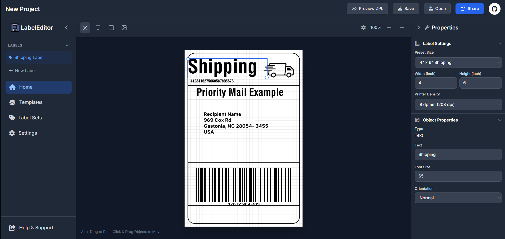

# ZPL GUI Editor V2 




---

## Built with:


---

## Quick Links

- [ZPL GUI Editor V2 ](#zpl-gui-editor-v2-)
  - [Built with:](#built-with)
  - [Quick Links](#quick-links)
  - [Overview](#overview)
  - [Live Demo](#live-demo)
  - [Features](#features)
    - [Status Legend](#status-legend)
    - [Label Editor](#label-editor)
    - [Item Management](#item-management)
    - [Import \& Export](#import--export)
    - [ZPL Elements](#zpl-elements)
    - [Saving \& Loading](#saving--loading)
    - [API and Database Integration](#api-and-database-integration)
    - [Other Label Languages](#other-label-languages)
  - [Getting Started](#getting-started)
    - [Prerequisites](#prerequisites)
    - [Installation](#installation)
    - [Usage](#usage)
  - [Project Roadmap Checklist](#project-roadmap-checklist)
  - [Contributing](#contributing)

---

## Overview

ZPL GUI Editor V2 is a **work-in-progress web editor** for Zebra Programming Language (ZPL) labels. The goal is to emulate a "photo editor" experience for ZPL, allowing users to **design, preview, and export labels** visually.
At the moment, this project is still under **active development** and **WILL** contain bugs or incomplete features.

---

## Live Demo 

See [Live Demo](https://html2zpl.vercel.app/) for the current working example of the editor. I would suggest turning off HTML objects in the settings to avoid the overlap of the preview. 

## Features

### Status Legend
| Badge                                                                                                              | Status             | Description                                               |
| :----------------------------------------------------------------------------------------------------------------- | :----------------- | :-------------------------------------------------------- |
|                                      | **Not Started**    | Feature is planned but work has not yet begun.            |
|                                                   | **WIP**            | Work is currently in progress.                            |
|  | **In Development** | Feature is being actively developed and tested.           |
|                                     | **Implemented**    | Feature is functional but may require further refinement. |
|                                          | **Complete**       | Feature is fully functional and verified.                 |


### Label Editor
   
- Add and position labels on a canvas **(Implemented)**
- Edit label properties: size, position, options **(Implemented)**
- Live label preview with update on change **(Implemented)**
- Toggle preview modes (on-save / on-change) **(Not Implemented)**

### Item Management
 
- Dynamic item creation (multiple items) **(Implemented)**
- Add, remove, and delete items **(Implemented)**
- Item selection & focus **(Implemented)**

### Import & Export
  
- Import ZPL files (parse & render) **(Not Implemented)**
- Export labels to ZPL (Preview implemented) **(Implemented)**
- Support multiple file formats **(Not Implemented)** 

### ZPL Elements
  
- **Text**: render & edit text fields **(Implemented)**  
- **Graphics**: render & edit shapes **(Implemented)**
- **Images**: render uploaded images **(Implemented)**
- **Barcodes**: render and handle input **(Not Implemented)**
- **Options**: configure ZPL element attributes **(Implemented)**

### Saving & Loading
  
- Local save & load (browser storage) **(Not Started)**
- Cloud save/load integration **(Not Started)**

### API and Database Integration
  
- API integration for cloud save/load **(Not Started)** 
- Database integration for cloud save/load **(Not Started)**

### Other Label Languages
  
- Support for P-Touch Labels **(Not Started)**
- Support for ZPL Labels to be Printed on Legal Size Paper **(Not Started)**

---

## Getting Started

### Prerequisites

Before getting started with Html2ZPL, ensure your runtime environment meets the following requirements:

-   **Server Software:** Node 21+

### Installation

1. **Clone the repository:**

   ```sh
   git clone https://github.com/retreat896/Html2ZPL.git
   cd Html2ZPL
   ```

2. **Install dependencies:**

   Navigate to the project directory and run:

   ```sh
   npm install
   ```

### Usage

**Development Server:**

To start the development server with hot-reload:

```sh
npm run dev
```

The terminal will show a local URL (typically `http://localhost:5173`). Open this URL in your browser to start using the editor.

**Building for Production:**

To create an optimized production build:

```sh
npm run build
```

The built files will be in the `dist` directory. You can preview the production build locally using:

```sh
npm run preview
```

---

## Project Roadmap Checklist

-   [x] **`The Begining`**: Implement a basic drag and drop label GUI
-   [x] **`Basic Item Creation`**: Implement some of the base label components such as text, graphic, and barcode.
-   [x] **`Basic Saving`**: Implement Label saving and item saving to "Cloud" using API.
-   [x] **`Basic Export`**: Implement Exporting to ZPL code from HTML Dom.
-   [x] **`Basic Import`**: Implement a way to import ZPL code into HTML.
-   [ ] **`API Creation`**: Implement an API to allow users to save and load their labels. 
-   [ ] **`Database Integration`**: Implement a database to allow users to save and load their labels.  
-   [ ] **`UI Overhaul`**: Implement a flat modern style GUI for the application.
-   [ ] **`Advanced API Integration`**: Add more complex features to the API like user login, OAuth, and more.
-   [ ] **`Advanced Saving`**: Implement a project manager to allow saving multiple label sets, sharing, and storage options.
-   [ ] **`Advanced Items`**: Implements advanced items such as Images and possibly custom user items.
-   [ ] **`Final UI Design`**: Implement the final UI design for the application.

---

## Contributing


-   ** [Report Issues](https://github.com/retreat896/Html2ZPL/issues)**: Submit bugs found or log feature requests for the project.
-   ** [Submit Pull Requests](https://github.com/retreat896/Html2ZPL/blob/main/CONTRIBUTING.md)**: Review open PRs, and submit your own PRs.

<h2>Contributors</h2>
<br>
<p align="left">
   <a href="https://github.com/retreat896/Html2ZPL/graphs/contributors">
      
   </a>
</p>


---
